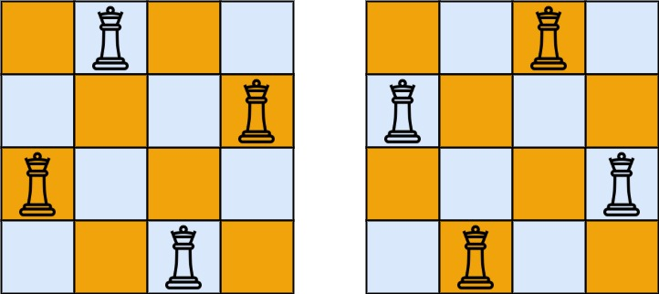

## Problem

The n-queens puzzle is the problem of placing n queens on an n x n chessboard such that no two queens attack each other.

Given an integer n, return all distinct solutions to the n-queens puzzle. You may return the answer in any order.

Each solution contains a distinct board configuration of the n-queens' placement, where 'Q' and '.' both indicate a queen and an empty space, respectively.

**Example 1**:



```plaintext
Input: n = 4
Output: [[".Q..","...Q","Q...","..Q."],["..Q.","Q...","...Q",".Q.."]]
Explanation: There exist two distinct solutions to the 4-queens puzzle as shown above
```

**Example 2**:

```plaintext
Input: n = 1
Output: [["Q"]]
```

**Constraints**:

- 1 <= n <= 9

## Solution

```javascript
/**
 * @param {number} n
 * @return {string[][]}
 */
var solveNQueens = function(n) {
    const result = [];
    const board = Array.from({ length: n }, () => Array(n).fill('.'));
    const cols = new Set();
    const diag1 = new Set();
    const diag2 = new Set();
    
    const backtrack = (row) => {
        if (row === n) {
        result.push(board.map((row) => row.join('')));
        return;
        }
    
        for (let col = 0; col < n; col++) {
        if (cols.has(col) || diag1.has(row + col) || diag2.has(row - col)) {
            continue;
        }
    
        cols.add(col);
        diag1.add(row + col);
        diag2.add(row - col);
        board[row][col] = 'Q';
    
        backtrack(row + 1);
    
        cols.delete(col);
        diag1.delete(row + col);
        diag2.delete(row - col);
        board[row][col] = '.';
        }
    };
    
    backtrack(0);
    
    return result;    
};
```

## Complexity Analysis

The time complexity of this solution is O(N!), where N is the number of queens. The space complexity of this solution is O(N^2), where N is the number of queens.

- Time complexity: O(N!)
- Space complexity: O(N^2)

## Explanation

This solution uses backtracking to solve the n-queens problem. We create a board of size n x n and initialize it with empty spaces. We also create three sets to keep track of the columns and diagonals where we can place the queens.
